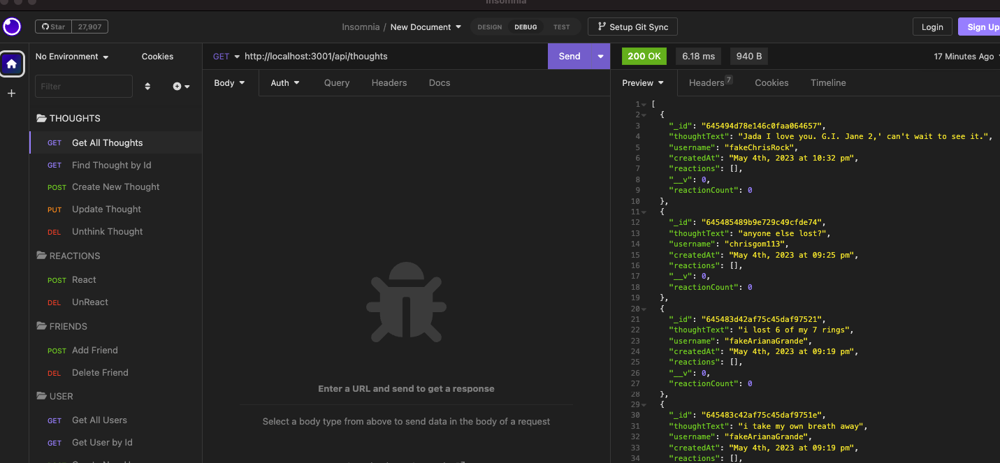
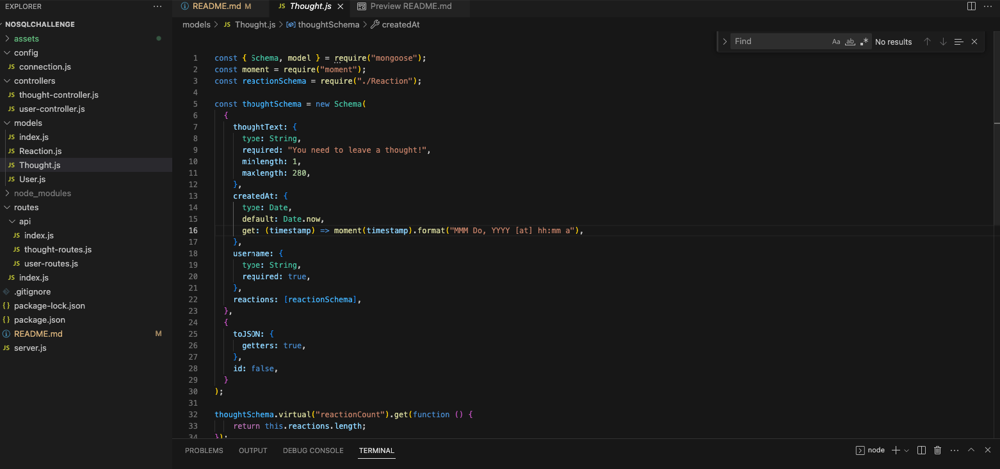

# Knockoff Bootleg Twitter : Social Network API

## Link to Github Repo: 
```
https://github.com/chrisgom113/knockoff-bootleg-twitter
```

## Walkthrough Videos:

Start App Server & User CRUD: https://drive.google.com/file/d/1aiNXG0ezp1S0n2fdz8AtC2NaJBl4yZe5/view

Thoughts CRUD: https://drive.google.com/file/d/1v6Qyc52OLR1O88qdQ2JL79t_T1M8ZHwA/view

Add and Remove FRIENDS: https://drive.google.com/file/d/179f2pDWCoIBu2nhqKiiiKvB1hwQCgCsL/view

Create and Remove REACTIONS: https://drive.google.com/file/d/1mu4NK27gj-_X7RbCSiCtjg3WSGOTkOHT/view
<p>&nbsp;</p>

# Description

This is a social network API that allows users to create their own account, share their thoughts, add friends, and react to friends’ thoughts. This app also uses Express.js for routing, and MongoDB database.

The goal of doing this challenge was to practice building an API using a NoSQL database and basically develop the entire backend for a social networking program.

Because only the backend was required for this challenge, Insomnia Core was used to test the routes and functionality.

See User Story for details

User Story:

```
AS A social media startup
I WANT an API for my social network that uses a NoSQL database
SO THAT my website can handle large amounts of unstructured data
```
# Installation

Use 'npm i' to download dependency packages:

## Tech

```
Node.js

NPM

Mongoose

Express

Moment

MongoDB
```

# Usage

- User can create a new user, get all users, get a single user by ID, update a user by ID, and delete a user by ID.
- User can create a new thought, get all thoughts, get a single thought by ID, update a thought by ID, and delete a thought by ID.
- User can create a new reaction, delete a reaction by ID.
- User can add a friend, delete a friend by ID.

The video walkthroughs above show how to use the routes in Insomnia Core while the below screenshots help visualize the Insomnia Core setup as well as the VS Code file structure.

## Insomnia Core Setup



## VS Code File Structure



# License

None